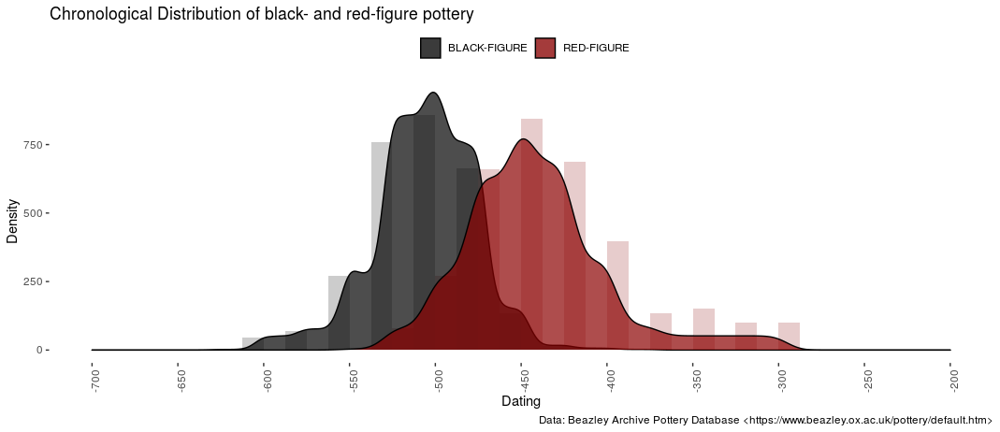

 <!-- badges: start -->
  
  
  
  <!-- badges: end -->

datplot
=======

Converting date ranges into dating 'steps' eases the visualization of changes in e.g. pottery consumption, style and other variables over time. This package provides tools to process and prepare data for visualization.

A rather common problem in archaeology is the fuzzyness of dates assigned to objects. If one wants to visualize overall changes in - let's say - pottery consumption, bar charts often fall short in that regard. If, e.g., the Phases a -- f are employed, then some of the objects can usually be dated to a, c, and f, as an example, but others will by classified as "a to c" or "b to c". But how can these data still be used for examining changes in a large set of objects without completely disregarding the information added by providing multiple phases for one object?

This package proposes implements the concepts of aoristic analysis to prepare archaeological data for the visualization using density plots. An example is shown in the vignettes, which can be found at

    browseVignettes("datplot")

after installing the package, or on GitHub in the /vignettes/ directory. Density plots are easy to understand and are usually aesthetically pleasing. They do omit a some information, such as individual counts, that bar histograms can communicate better. On the other hand, ranges can be incorporated into the visualization as well to regard the variety of timespans archaeological objects may be dated to.

I imagine this to be mostly useful for surveys and other analysis aimed at the longue duree. The package has been published along with a case study on the Inscriptions of Bithynia, which are now included as a Data object in the datplot-package itself, in (citation). 

Recommendation
-------
People interested in employing this method should also consider taking a look at [ISAAKiel's package aoristAAR](https://github.com/ISAAKiel/aoristAAR/), or at [archSeries](github.com/davidcorton/archSeries), [tabula](github.com/nfrerebeau/tabula/) and [rtefact](github.com/ahb108/rtefact). 

Installation 
-------
'datplot' is not currently on CRAN. It can be installed from GitHub with devtools:

    devtools::install_github("lsteinmann/datplot")

Or via downloading the latest release and installing from the file: 

    devtools::install_local(path = "../datplot_0.2.4.tar.gz")

Contact
-------

Please feel free to use this idea or the package in your research. I would be happy if you contacted me if you do, because I'm interested to know whether this helps anybody. Also, if you have other ideas, critique or improvements, I would be very glad to hear from you or review your pull requests and changes! 

