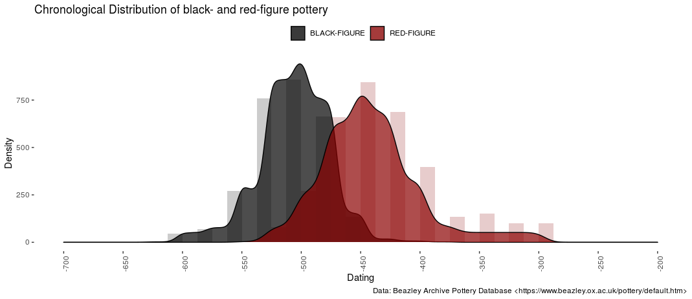

<!-- badges: start -->

<!-- badges: end -->

[datplot](https://lsteinmann.github.io/datplot/)
=======

Converting date ranges into dating 'steps' eases the visualization of changes in e.g. pottery consumption, style and other variables over time. This package provides tools to process and prepare data for visualization.

A rather common problem in archaeology is the fuzziness of dates assigned to objects. If one wants to visualize overall changes in - let's say - pottery consumption, bar charts often fall short in that regard. If, e.g., the Phases a -- f are employed, then some of the objects can usually be dated to a, c, and f, as an example, but others will by classified as "a to c" or "b to c". But how can these data still be used for examining changes in a large set of objects without completely disregarding the information added by providing multiple phases for one object?

This package proposes implements the concepts of aoristic analysis to prepare archaeological data for the visualization using density plots. An example is shown in the vignettes, which can be found at

    browseVignettes("datplot")

or [on the pkgdown-site](https://lsteinmann.github.io/datplot/articles/how-to.html) after installing the package, or on GitHub in the /vignettes/ directory. Density plots are easy to understand and are usually aesthetically pleasing. They do omit a some information, such as individual counts, that bar histograms can communicate better. On the other hand, ranges can be incorporated into the visualization as well to regard the variety of timespans archaeological objects may be dated to.

Publication
-------
The package at version 1.0.0 has been published along with a case study on inscriptions from Bithynia: [Steinmann, L., & Weissova, B. (2021). Datplot: A New R Package for the Visualization of Date Ranges in Archaeology. Advances in Archaeological Practice, 1-11. doi:10.1017/aap.2021.8](https://doi.org/10.1017/aap.2021.8). Data used in the case study is included in the package.

Recommendation
-------
People interested in employing this method should also consider taking a look at [ISAAKiel's package aoristAAR](https://github.com/ISAAKiel/aoristAAR/), or at [archSeries](https://github.com/davidcorton/archSeries), [tabula](https://github.com/tesselle/tabula), [rtefact](https://github.com/ahb108/rtfact), [aoristic-analysis (LimesLimits)](https://github.com/LimesLimits/aoristic-analysis) and (in the future) [baorista](https://github.com/ercrema/baorista). 

Installation 
-------
'datplot' can be installed from GitHub with devtools:

    devtools::install_github("lsteinmann/datplot")

Or via downloading the latest release and installing from the file: 

    devtools::install_local(path = "../datplot_1.x.x.tar.gz")
    
In case you are unable to find the vignettes after installing from github directly, try: 

    devtools::install_github("lsteinmann/datplot", build_vignettes = TRUE)

But you may have to install vignette dependencies manually (see suggests in the DESCRIPTION). Anyone who has the tidyverse installed should encounter no issues.

Contact
-------

Please feel free to use and change the code to your liking. We would be happy for any feedback on the package, or if you you notify us of your publications using this package!

